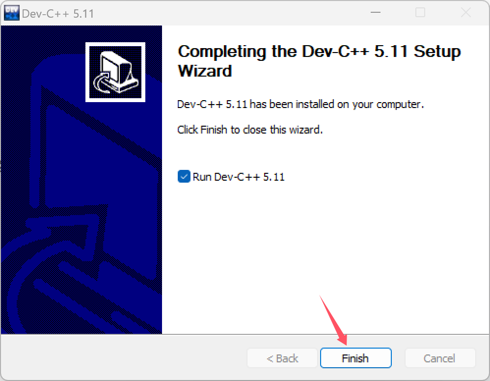
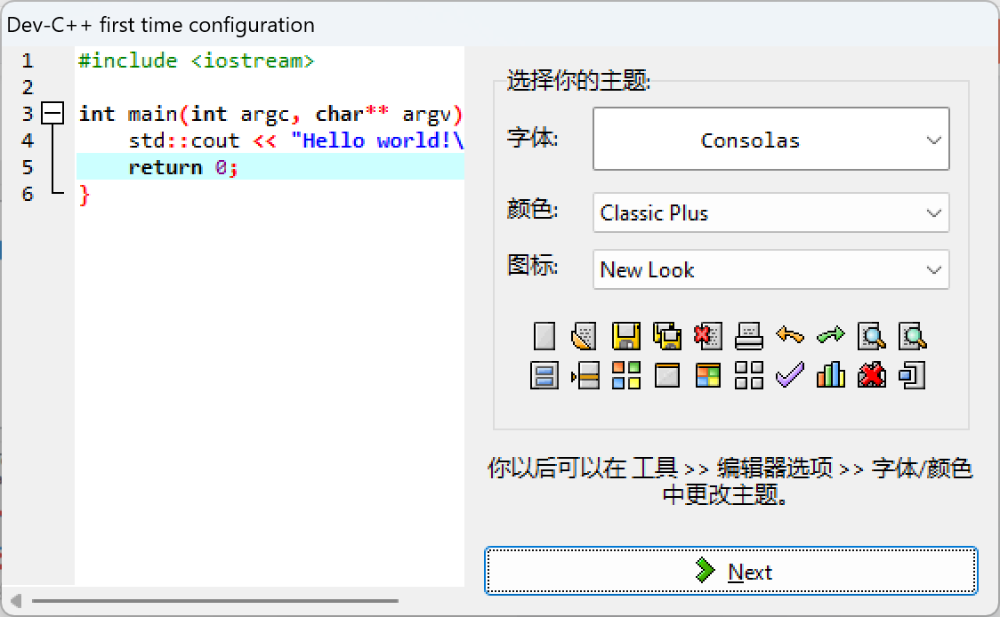
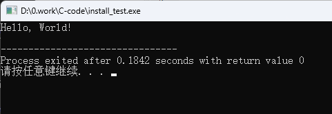

## 软件介绍

`Dev C++`是一款功能强大的 **C/C++** 语言编译器，不仅界面美观、可操作性高、使用方便，最最重要的是它还是免费的。

我们后续的C语言编程，都将使用Dev C++。

## 软件下载

### sourceforge官网下载

从sourceforge官网上下载。链接如下：

<center> 

[👉Dev-C++👈](https://sourceforge.net/projects/orwelldevcpp/)

</center> 

> 提示：SourceForge 是全球最大开源软件开发平台和仓库，网站建立的宗旨，就是为开源软件提供一个存储、协作和发布的平台，拥有大量非常优秀的开源软件


  


点击`Download`下载后，等待几秒便会弹出下载提示，下载完成后根据第二部分安装步骤进行软件的安装即可。

### 百度网盘下载

我下载了本系列教程的版本，保存在了百度网盘。如果你不放心说明的链接或者上面sourceforge官网下载不了，那就下载百度网盘的。

> 通过百度网盘分享的文件：IDE
> 链接：https://pan.baidu.com/s/14TXZLAfEbx-xkuArETeJmg 
> 提取码：LGYY 

## 安装步骤

1. 双击下载下来的 `Dev-C++Setup.exe` 运行安装程序。

2. 点击OK，先不管语言，默认选择English。

  

3. 点击 `I Agree`

  

4. 点击`Next`，全部组件都安装。

  

5. 选择软件安装路径，如果使用默认安装路径安装在`C盘`，直接点击 `Install` 即可。如果更换安装路径，则点击`Browser`，选择相应的安装路径即可，如下图我的安装路径是`D盘/IDE/dev`，Dev-Cpp是它自己会生成的文件夹。确认路径之后点击 `Install` 。

  

6. 软件安装完成。点击Finish

  

7. 在打开的页面中，我们选择`简体中文/Chinese`，然后点击`Next`。

  

8. 设置软件字体、颜色、图标等属性，如果选择使用默认形式，直接单击 `Next` 即可。

  

9. 提示已经设置成功，说明就配置好了嘛，点击OK，就会打开界面了。

  


## 安装验证

1. 按键盘的 `Ctrl+N` 键，快速新建一个文件。

  

2. 往里面写入下面的代码：

> 在C语言中，`//` 表示单行注释的开始。任何在 `//` 之后直到该行末尾的文本都会被编译器忽略，不会影响程序的编译和执行。**注释的主要目的是为了提高代码的可读性**，帮助程序员或其他人理解代码的功能和逻辑。**大家C语言大成后一定要养成习惯注释！！！**

```c
#include <stdio.h> // 引入标准输入输出库的头文件

int main() {
    // printf函数用于打印格式化的字符串到标准输出
    printf("Hello, World!\n");
    return 0; // 表示程序执行成功
}
```
这个代码的主要功能就是在命令窗口输出一个字符串: `Hello, World!`，其中`\n`是特殊字符，表示的是换行显示的意思。

这个程序的其他C语言编程的基本元素：

| 代码 | 说明 |
| :--: | :---: |
| #include <stdio.h> | 预处理器指令，用于包含标准输入输出库的头文件，这样我们才能使用printf函数。 |
| int main() | 主函数，每个C程序都是从main函数开始执行的。 |
| printf("Hello, World!\n"); | 调用printf函数，打印字符串到控制台。 |
| return 0; | 表示程序正常结束。 |

接下来我们来验证我们安装的IDE能不能运行代码。现在保存我们新建的文件，我这里将它命名为`install_test.c`，并保存到我指定的文件夹。

> 保存的快捷键是 `Ctrl+S`

>! 必须要对新建的文件要改动才能够保存！


  

3. 运行代码

要先经过编译，编译之后才能够运行。如果你确保你的代码没有问题，可以选择编译+运行同时进行。

  

我这里直接编译运行了。可以按快捷键F11。

如果不出意外的话，会弹出一个命令窗口，里面的内容显示的就是`Hello, World!`

  


结束。