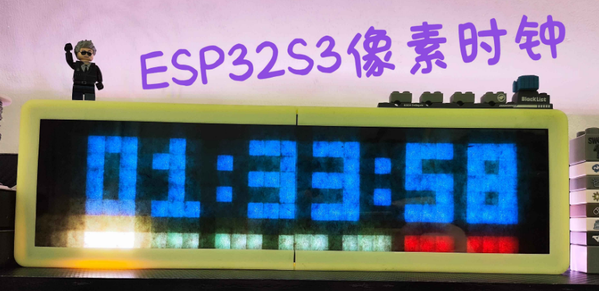
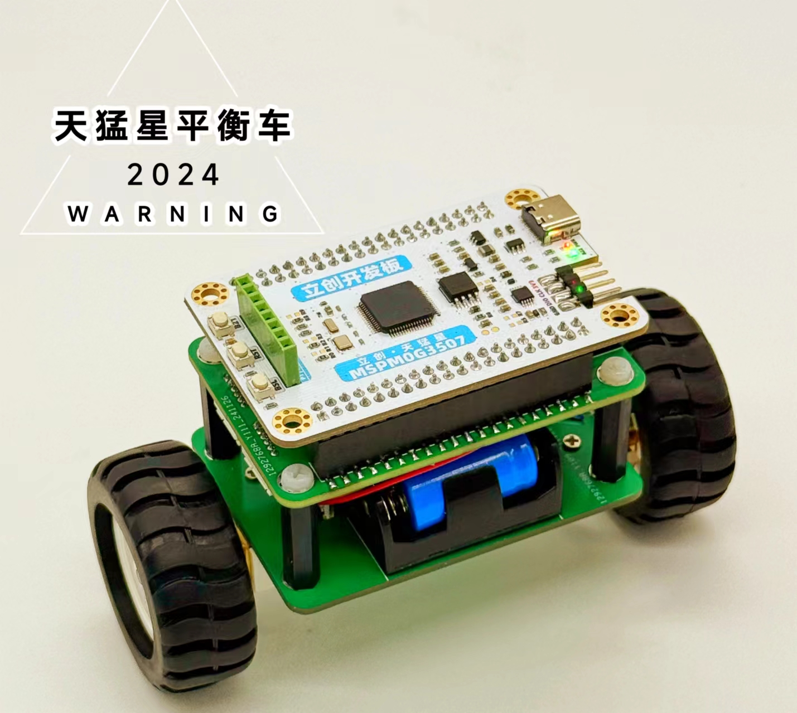

## 物联网像素时钟

基于立创·ESP32S3R8N8开发板制作的像素时钟，包含网络时钟、天气显示、温湿度显示、黑客帝国数字雨特效、音律拾音灯等功能。

开发方式：VSCode下的platformIO + arduino环境。

  

## 天猛星平衡车

基于立创·天猛星MSPM0G3507开发板制作的小平衡车。

> MSPM0G3507为TI德州仪器制作的ARM 32位 Cortex M0+ CPU。最高80MHz,128K FLASH + 32K SRAM.

  

## 个人WIKI网站搭建

基于开源的teedoc框架搭建的个人WIKI资料记录网站。

  

## 年轻人的第一台舰防炮

K230 AI视觉识别开发板 + 电动玩具枪 组成的目标自动跟踪炮台。

## WIFI图传小车

基于嘉立创EDA和ESP32S3R8N8开发板设计的WIFI图传小车。通过ESP32S3自带的WIFI功能，将OV2640摄像头采集的图像数据通过WIFI进行10米左右的图传。

## 电子物料收纳盒